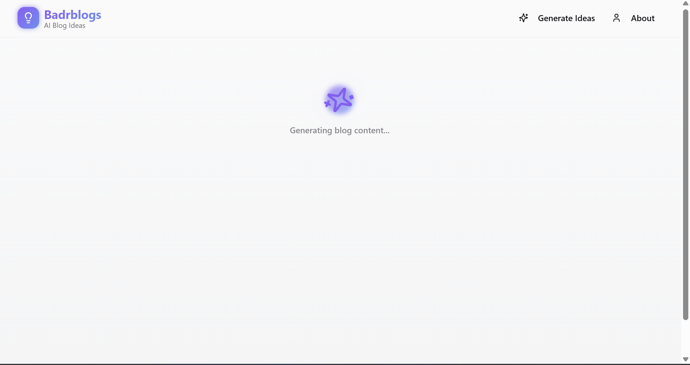
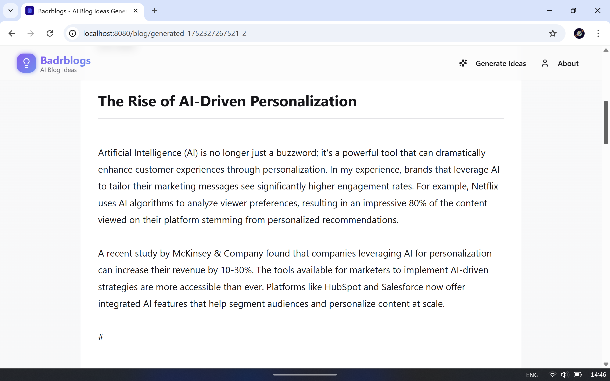

# Badrblogs

A modern AI-powered blog idea generator that helps content creators generate engaging blog post ideas instantly.

## Features

- **AI-Powered Generation**: Generate creative blog post titles and descriptions using OpenAI's GPT-4o-mini
- **Full Blog Content**: Click any idea to generate complete, topic-specific blog posts with rich, detailed content
- **Smart Content Generation**: AI creates unique, engaging blogs tailored to specific topics (travel, tech, general)
- **Topic-Based Ideas**: Input any topic or niche to get 5 professionally crafted blog post ideas
- **Responsive Design**: Beautiful, mobile-first design that works perfectly on all devices
- **Real-time Generation**: Fast idea and content generation with elegant loading states
- **Mock Data Fallback**: Fully functional even without OpenAI credits - perfect for local development and demos

## Technologies Used

- **Frontend**: React 18, TypeScript, Vite
- **Styling**: Tailwind CSS, shadcn/ui components
- **Backend**: Supabase (Edge Functions)
- **AI**: OpenAI GPT-4o-mini API (optional - mock data fallback included)

## Getting Started

### Prerequisites

- Node.js 18+ and npm
- Supabase account and project (for Edge Functions)
- OpenAI API key with credits (for real AI generation - app includes fallback mock data)


### OpenAI Integration Setup

**Status**: ✅ **PRODUCTION READY** - Real OpenAI integration enabled!

#### Requirements
1. OpenAI API key must consist of suffecient credits 
#### Content Quality
**Production-Level AI Content**:
- ✅ Specific examples: "Stanford's CheXNet for X-ray analysis"
- ✅ Real research references: "MIT's 2023 study on AI diagnosis" 
- ✅ Technical details: "Using TensorFlow for medical image processing"
- ✅ Varied article structures and engaging storytelling
- ✅ 600-800 words of unique, expert-level content
- ✅ Topic-specific details (landmarks for travel, code for tech, etc.)

#### Error Handling
- **No API key**: Clear error message with configuration instructions
- **No credits**: Specific error asking to add credits to OpenAI account
- **Rate limits**: Proper error handling with retry suggestions

## Project Structure

```
src/
├── components/          # Reusable UI components
├── pages/              # Route components
├── lib/                # Utility functions
├── integrations/       # Supabase integration
└── index.css          # Global styles and design tokens

supabase/
└── functions/          # Edge functions (auto-deployed)
```

## Features Overview

- **Clean, Modern UI**: Built with Tailwind CSS and shadcn/ui components
- **Responsive Design**: Works perfectly on desktop, tablet, and mobile
- **Advanced AI Content**: Uses OpenAI's GPT-4o-mini with topic-specific prompts for high-quality, unique blog content
- **Smart Content Adaptation**: Different content strategies for travel, tech, and general topics
- **Professional Formatting**: Blog posts include proper markdown formatting, headers, and structure
- **Intelligent Fallback System**: High-quality mock content when AI is unavailable
- **No Authentication Required**: Simple, accessible design without login barriers

## Deployment

This app will later be deployed using Azure. 

## Author

Created by **Badreldin Elsayed**, First Year Computer Science Student at the University of Manchester. I personally created this project because it seemed as a brilliant idea to me, and I gained a lot of experience and learnt new things from building it. 

## Skills Gained 
- Basic Frontend Development (Was learning frontend skills while building, still a beginner in frontend though) 
- API Integration 
- Cloud & Serverless Backends
- AI Integration and Engineering 
- Security
- Software Engineering Workflows (Version control with Git & GitHub, Branching, merges, conflict resolution,Writing clean commit messages)

## Problems Faced
Two main problems were faced building this project:  
- At the beginning of working on this project I was facing very huge issues with pushing my commits, I had to use AI for that. 
- Faced a lot of difficulty implementing OpenAI API into my module, was able to overcome this problem but took a lot of time and hard work.  

## Tech Stack

Built with modern web technologies:
- **Vite** for fast development and building
- **TypeScript** for type safety
- **React 18** with modern hooks and patterns
- **Tailwind CSS** for responsive styling
- **Supabase** for backend Edge Functions
- **OpenAI** for AI-powered content generation


## Project Showcase 


### Main Page
.png)

### Home Page
.png)
.png)

### Blog Page
.png)

### Blog Loading


### About Page
.png)
.png)
.png)
.png)


### Blog Content Example


## 📄 Blog Example Text

See the blog content example here: [blog-content.txt](screenshots/blog-content.txt)


